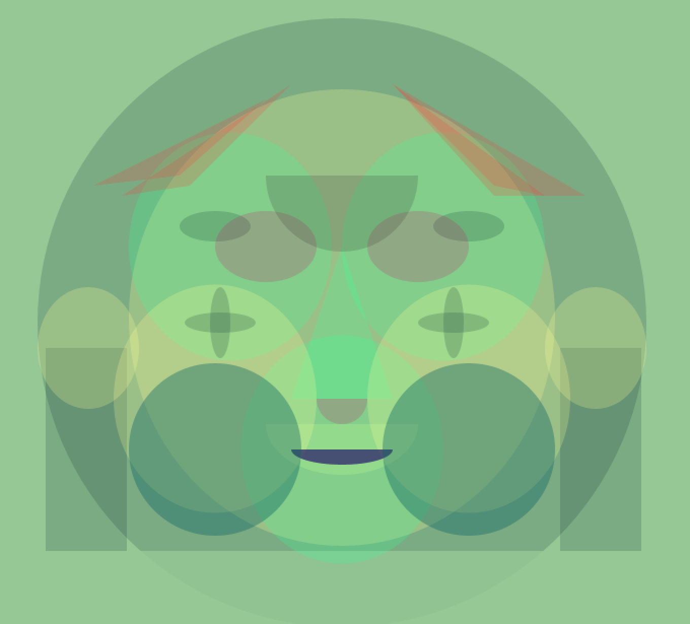

Questions I faced when using Processor:
- How can make arc angle to a certain degree? like Pac-man's mouth from facing right to facing up?
- The color is very hard to adjust. I still do not quite how adding what equals what. 
- Is it possible to make stokes thicker? I tried to find ways on the cheat sheet but couldn't find any

